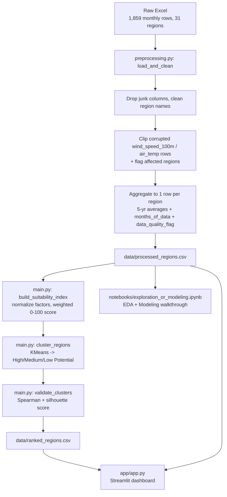

# Renewable Energy Site Suitability Analyzer

Analyzes and ranks candidate sites for renewable energy development based on geographic and environmental suitability criteria.

## Problem Statement

Choosing where to site a new solar or wind project means weighing a lot of climate variables at once — solar irradiance, wind speed, cloud cover, humidity — across many candidate regions. Doing this by eye across dozens of states/UTs and years of monthly records is slow and easy to get wrong. This project turns 5 years of monthly climate and resource data for India into a single, adjustable **suitability score** per region, groups regions into potential tiers, and exposes both through an interactive dashboard so planners and investors can shortlist candidate sites and stress-test that shortlist against different solar/wind priorities.

## Dataset

**Source:** [Kaggle — Renewable Energy and Meteorological Data of India](https://www.kaggle.com/)

The raw file (`data/raw_energy_meteo.xlsx`) is a 5-year **monthly** climate dataset (2019–2023, 1,859 rows) covering 31 Indian states/UTs, with solar (GTI, DNI, GHI, clearsky variants, cloud opacity, albedo), wind (wind speed at 100m), and general meteorological columns (air temperature, humidity, surface pressure, precipitation rate), plus renewable generation potential columns (wind, solar, biomass, hydro).

This project aggregates that monthly data down to **one row per region** — a 5-year climate baseline — via [src/preprocessing.py](src/preprocessing.py). It also fixed two corrupted columns discovered during analysis (see [Limitations](#limitations)) and adds a `months_of_data` and `data_quality_flag` column to the aggregated output for transparency.

## Tools Used

- **Python 3.9**
- **pandas** — data loading, cleaning, aggregation
- **openpyxl** — reads the raw `.xlsx` source file
- **scikit-learn** — KMeans clustering, silhouette score
- **scipy** — Spearman rank correlation (cluster validation)
- **Streamlit** — interactive dashboard
- **Plotly** — interactive charts in the dashboard (hoverable scatter/bar)
- **matplotlib** — static charts in the exploration notebook
- **Jupyter** — EDA and modeling walkthrough notebook

## Workflow



## AI/ML Component

**Weighted suitability index.** Four factors are min-max normalized to 0–1 (`src/utils.py:normalize_column`) — solar (GTI) and wind (wind speed @ 100m) where higher is better, and cloud opacity and humidity where lower is better (`invert=True`) — then combined into a single 0–100 `suitability_score` using user-adjustable weights (`src/main.py:build_suitability_index`). Weights are validated and auto-normalized to sum to 1 (`src/utils.py:validate_weights`).

**KMeans clustering.** Regions are then grouped into "High / Medium / Low Potential" tiers by running KMeans (`src/main.py:cluster_regions`) on the same four normalized factors, with cluster labels assigned by ranking each cluster's average `suitability_score`.

**Why clustering adds value over a plain weighted score:** a sorted list of scores is a continuum — there's no natural place to draw a line between "good" and "not good enough." KMeans clusters on the full 4-dimensional factor space (not just the 1-D score), so it can group regions by their overall resource *profile* rather than an arbitrary score cutoff, giving planners actionable tiers instead of 31 individual numbers to interpret. That said, clustering isn't free of judgment calls — cluster boundaries can land awkwardly between two very similarly-scored regions (documented live in the app and notebook). To keep that honest, every cluster run is validated with:
- **Spearman correlation** between each region's suitability rank and its cluster's average rank (checks internal consistency), and
- **silhouette score** (checks how well-separated the clusters actually are).

Both are printed by `validate_clusters()` and shown in the notebook and app so the tiers are never presented as more authoritative than the data supports.

## How to Run

```bash
pip install -r requirements.txt
streamlit run app/app.py
```

Open the URL Streamlit prints (defaults to `http://localhost:8501`). Use the sidebar sliders to adjust solar/wind/cloud/humidity weights — the ranked table, charts, and cluster tiers update live.

To run the pipeline standalone (regenerates `data/processed_regions.csv` and `data/ranked_regions.csv`):

```bash
python3 src/main.py
```

## Screenshots

**Ranked Regions table** (with the ⚠️ wind-capped data quality flag on Tamil Nadu and Punjab):


**Top 10 by Suitability Score:**


**Solar vs. Wind Potential by Cluster:**


## Documentation

- [Project Report](docs/project_report.md) — problem, stakeholders, dataset, methodology, results, limitations, and future improvements in full write-up form.
- [Presentation Outline](docs/presentation_outline.md) — slide-by-slide bullet content, ready to paste into Canva/PPT.

## Results & Insights

_[To be filled in — see `data/ranked_regions.csv` for the full ranking and `notebooks/exploration_or_modeling.ipynb` Section 2 for the scenario comparison across solar-heavy/wind-heavy weightings.]_

## Limitations

- **5-year averages hide seasonal variation.** A region with strong annual averages may still have unproductive months (e.g. monsoon cloud cover, winter wind lulls) that don't show up in a single yearly baseline.
- **No land availability, grid proximity, or regulatory clearance data is included.** A high `suitability_score` reflects climate resource only, not overall project feasibility.
- **Scores are relative rankings, not investment guarantees.** They're useful for shortlisting candidate regions, not for financial commitments.
- **Cluster boundaries reflect KMeans' automatic grouping** and can split closely-scored regions into different tiers — e.g. Tamil Nadu has the single highest `suitability_score` of all 31 regions but lands in "Medium Potential," while lower-scoring Punjab lands in "High Potential."
- **Source data corruption for Punjab and Tamil Nadu.** Their raw `wind_speed_100m` readings were corrupted (values in the hundreds — physically impossible at 100m hub height), and Punjab's raw `air_temp` was literally the `YEAR` value. `load_and_clean` clips both to a physically plausible range before averaging, but this means Punjab and Tamil Nadu are tied at the clip ceiling — their true relative wind advantage over each other is unrecoverable from the source file. Both are marked `wind_speed_capped` in `data_quality_flag` and flagged in the app's ranked table.
- **Meghalaya has only 59 of the expected 60 months of data** (flagged via `months_of_data`).

## Future Improvements

- Go back to the original data provider to recover true wind_speed_100m values for Punjab and Tamil Nadu, rather than clipping.
- Bring in land availability, grid/transmission proximity, and regulatory/permitting data to move from climate suitability toward true project feasibility.
- Score at a finer time resolution (seasonal or monthly) instead of a single 5-year average, so seasonal risk is visible per region.
- Try alternative clustering approaches (e.g. hierarchical clustering, or letting the number of clusters vary) and compare against KMeans.
- Incorporate the existing but currently unused `solar`/`wind`/`biomass`/`hydro` generation-potential columns into a multi-technology suitability comparison.

## Team

Solo project — **Vedant Chaudhary**
