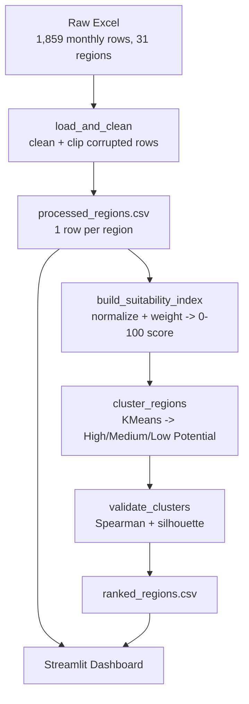
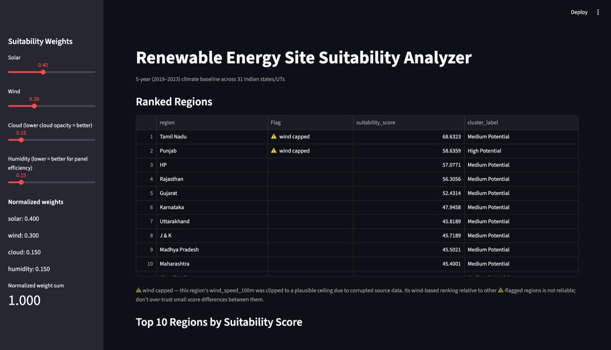
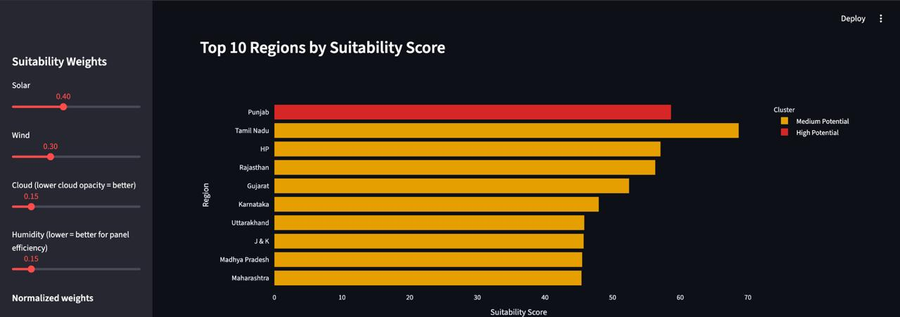
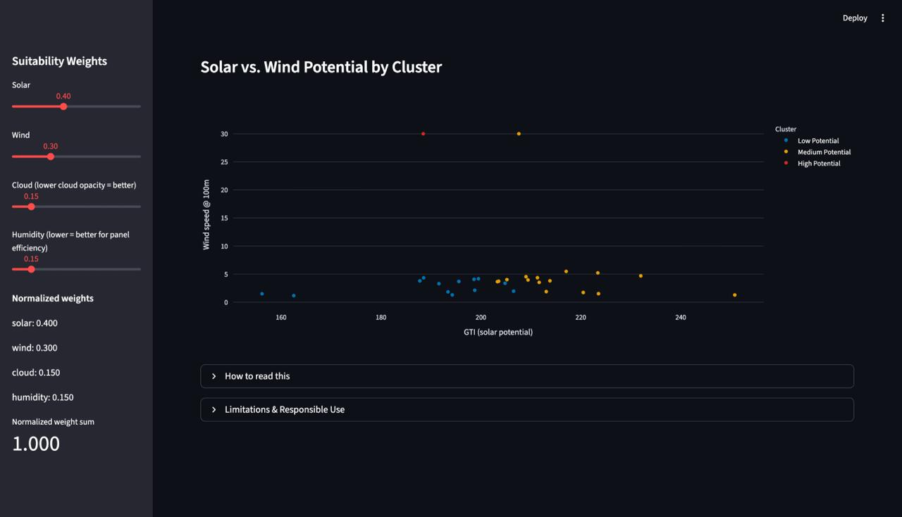

# Presentation Outline — Renewable Energy Site Suitability Analyzer

10-slide structure, ready to paste into Canva/PowerPoint. Each slide has a suggested title and full bullet content.

---

## Slide 1 — Title

**Renewable Energy Site Suitability Analyzer**

- Data-driven site screening for solar & wind development across India
- Vedant Chaudhary (solo project)
- [Course / event name, date]

---

## Slide 2 — Problem & Impact

- Choosing where to site a solar or wind project means weighing many climate variables at once — solar irradiance, wind speed, cloud cover, humidity — across dozens of regions and years of data
- Manual comparison is slow, inconsistent, and easy to get wrong
- **Impact:** a repeatable, adjustable tool that turns raw climate data into a single suitability score per region, so planners, investors, and policymakers can shortlist candidate sites in minutes instead of days
- Deliberately scoped as a **climate screening aid** — not a substitute for land, grid, or regulatory due diligence

---

## Slide 3 — Dataset

- **Source:** Kaggle — *Renewable Energy and Meteorological Data of India*
- **5 years, monthly** climate data (2019–2023), **1,859 rows**, **31 Indian states/UTs**
- Variables: solar (GTI, DNI, GHI, cloud opacity, albedo), wind (wind speed @ 100m hub height), general climate (air temp, humidity, pressure, precipitation), plus renewable generation potential columns
- Aggregated to **one row per region** — a 5-year climate baseline — with a `months_of_data` completeness count and a `data_quality_flag` for known source-data issues

---

## Slide 4 — Workflow

- Raw Excel → clean & clip → per-region baseline → score → cluster → validate → dashboard
- Every stage is reproducible via `python3 src/main.py`

---

## Slide 5 — AI/ML Innovation

**Two ML/analytical contributions, both first-class, not footnotes:**

**1. Weighted suitability index + KMeans clustering**
- Four climate factors min-max normalized to 0–1 (solar & wind: higher=better; cloud & humidity: inverted, lower=better)
- Combined into a single adjustable 0–100 `suitability_score` via user-controlled weights (validated & auto-normalized to sum to 1)
- KMeans clusters regions into "High/Medium/Low Potential" tiers using the *full 4-dimensional factor profile*, not just the 1-D score — giving planners actionable groups instead of 31 raw numbers
- Every clustering run is validated, not just trusted: Spearman correlation (rank consistency) = **0.8743**, silhouette score (cluster separation) = **0.3351**

**2. Automated data validation & corruption detection**
- While testing the dashboard, a scatter plot exposed a **wind_speed_100m value of 977.7 m/s for Punjab** — physically impossible at 100m hub height
- Root-caused to source-data corruption: Punjab's raw `air_temp` was literally the `YEAR` value; Tamil Nadu's `wind_speed_100m` was also corrupted
- Because min-max normalization is sensitive to outliers, this single corrupted value had been silently distorting every region's wind score and inflating Punjab's ranking project-wide
- **Fix:** plausible-range clipping in preprocessing (wind speed → [0, 30] m/s, air temp → [-25, 50] °C, calibrated so it doesn't clip HP's genuine high-altitude winter lows) + a new `data_quality_flag` column that marks affected regions and is surfaced live in the dashboard (⚠️ icon + explanatory caption) so results are never presented as more trustworthy than the source data allows

---

## Slide 6 — Demo Screenshots

- Live sidebar sliders for solar/wind/cloud/humidity weights, auto-normalized in real time
- Ranked table with ⚠️ data-quality flag column
- Interactive hover scatter (region name on hover) and top-10 bar chart, both colored by cluster tier

---

## Slide 7 — Results

**Top 3 (default weighting):**
1. **Tamil Nadu — 68.63** (Medium Potential)
2. **Punjab — 58.64** (High Potential)
3. **HP — 57.08** (Medium Potential)

- **Disclosed score/cluster mismatch:** Tamil Nadu has the single *highest* score of all 31 regions but lands in "Medium Potential," while lower-scoring Punjab lands in "High Potential" — flagged deliberately in-app as a reminder that tiers are a rough grouping, not a strict ranking
- **Scenario sensitivity:** HP tops the solar-heavy weighting (#1) but drops to **#10** under wind-heavy weighting; Punjab shows the mirror pattern — #19 under solar-heavy, back to #2 under wind-heavy — its overall ranking is wind-driven, not solar-driven
- **Balanced, low-risk candidates:** Karnataka, Madhya Pradesh, and Maharashtra stay consistently mid-pack (ranks ~5–10) across *all three* weighting scenarios — strong picks regardless of which resource an investor prioritizes

---

## Slide 8 — Limitations

- **Wind-speed-capped regions (Punjab, Tamil Nadu) have an unrecoverable true ranking** relative to each other — the clip prevents distortion of everyone else's scores, but their exact relative wind advantage can't be recovered from the corrupted source file
- **5-year averages hide seasonal variation** — strong annual numbers can mask unproductive months (monsoon cloud cover, winter wind lulls)
- **No land availability, grid proximity, or regulatory clearance data** — a high score reflects climate resource only, not overall project feasibility
- **Meghalaya has only 59 of 60 expected months of data**
- **Latitude/longitude duplicated across regions** — only 29 unique coordinate pairs for 31 regions, a source-data issue that would affect any geospatial/mapping extension
- Scores are relative rankings, not investment guarantees

---

## Slide 9 — Future Improvements

- Recover true `wind_speed_100m` values and correct duplicate lat/long pairs at the data-provider level, rather than clipping/tolerating them
- Add land availability, grid/transmission proximity, and regulatory data to move from climate suitability to full project feasibility
- Score at seasonal/monthly resolution instead of a single 5-year average
- Compare KMeans against alternative clustering approaches (hierarchical, variable cluster count)
- Extend to a multi-technology comparison using the existing but unused `biomass`/`hydro` generation columns

---

## Slide 10 — Conclusion

- Turned 5 years of raw, messy monthly climate data into a validated, adjustable, interactive suitability tool for 31 Indian regions
- Went beyond a plain weighted score: added KMeans tiering (with statistical validation) *and* caught + fixed a real source-data corruption issue mid-project — disclosed transparently rather than hidden
- Balanced, resilient candidates (Karnataka, Madhya Pradesh, Maharashtra) emerged as the most defensible picks across every tested investment priority
- Thank you — questions welcome
